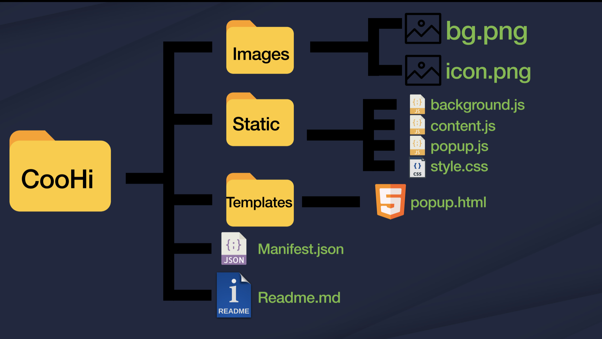

# <u>**CooHi**</u>

#### Made originally for my CS50 final project

## Description:

**CooHi** is a **simple Chrome extension** to **remove** the annoying **cookie banners** from websites, and therefore **protect your privacy!**. 

## Explanation:

The basics on how it's operated is that it <u>**takes the elements**</u>  of a <u>**website**</u> and if they have somethings that are related to common Cookie Notices (Like **"<u>accept all</u>"** buttons, **"<u>cookies</u>"** ids, and <u>**more**</u>), <u>**it hides what contains them**</u>. You can <u>**add exceptions**</u>, and <u>**remove them by writing**</u> in the popup the <u>**url**</u>. The urls will be displayed in the popup of the extension and they will be <u>**sorted by length**</u> using the <u>**Bubble Sort**</u> algorithm. By <u>**hiding cookies notices**</u> that you can <u>**avoid being disturbed**</u> by them, and <u>**protect your privacy**</u> from the abusive cookies of websites!

## Notes:

- Please take into account that the way the extension works is by checking if the ids, classes, or buttons, contain some specific words, and so <u>**if the website doesn't use any of those words the extension won't hide anything**</u>. However, <u>**this is unlikely because all cookie banners have buttons with words like "accept", but it could happen if the website was in another language**</u> other than English or Spanish and so it would hide those.

## Detailed Explanation:

- **What does it use:** This Chrome extension uses <u>**javascript for the functionalities**</u> and for the <u>**bubble sort algorithm**</u>. <u>**Bootstrap, css and html**</u> are used for the design of the extensions popup. And at last <u>**Chrome's storage**</u> to remember the exceptions that the user added and in the order that the Bubble Sort algorithm sorted them.

- **Note:** <u>**The code has comments everywhere to better explain everything in case of further doubt**</u>, nonetheless I'll try to explain it all here.

    - **Composition:**

    

    - **background.js:** is a service worker, which means it operates in the background. It is the first thing to execute, and will send a message "loaded" to the other scripts, to tell them that a tab has been loaded. To see how it was coded, please look at the code comments in the file.

    - **content.js:** is a content script which when receiving the "loaded" message from background.js, will execute the HideCookies function to hide the cookie banner of the website unless the current url is in the exceptions list that the user added in Chrome's storage. If it isn't there it will execute the following function inside the HideCookies function: CheckID(), CheckCLASS(), CheckBUTTONTEXT(), HideYTOverlay(), EnableStuff(), document.body.style.overflow = 'auto';.

    - **popup.js:** is the extensions popup javascript script. It will run when the popup is triggered by the user. It will first make sure that the DOM(Document Object Model, programming interface for web documents) is fully loaded. It will display the 3 top exceptions if any, and if the user clicks the add button from the popup with an url, all the urls will be sorted by length using the Bubble Sort algorithm and then they will stored in that order to Chromes Storage, however if the url the user added was already in, it will remove it from exceptions list in Chromes Storage, and sort and store everything again in order.

    - **styles.css:** The CSS file responsible for styling the popup.

    - **popup.html:** is the popup interface of the extension. It appears when the user activates the extension, utilizing styles from styles.css and Bootstrap for input text boxes to add or remove exceptions, as managed by popup.js.

## Extra Comments about the project:

When I first had the idea I wanted to simply make a chrome extension that would delete cookies and data from websites. However this turned out to be a nightmare, because even with the correct permission, they wouldn't get deleted or would just reappear. I tried deleting them by getting the name and domain, but they would still appear, then I tried setting their expiration date to a past date, but it would still not work. So I ended up with this idea to simply not accept cookies. This was simpler but in a way less reliable until I took into account that all cookie banner have button with words like "accept", or "ok", so by using Chrome Dev Tool, chromes documentation and that information, I ended up getting a functional cookie banner hider. However there were some websites where this could disable their functionality, so I ended up doing 2 things, forcefully enabling the blocked functions and by allowing the user to add exceptions. However I ran into some problems with Chromes Storage, which held me back for 4 days, but I updated my manifest version to 3, even though I didn't know anything about that, and then fixed the errors. And it ended up finally working. And that's how I got here. This project just challenging but in the end very fun to work with and I learned a lot of new things on how websites operate and how Chrome does too. My thanks to the CS50 team for this wonderful course!

## Learned this style from: 
- https://www.w3schools.io/file/markdown-introduction/
- https://www.javatpoint.com/underline-in-markdown
- https://stackoverflow.com/questions/4823468/comments-in-markdown
- https://www.javatpoint.com/images-in-markdown
